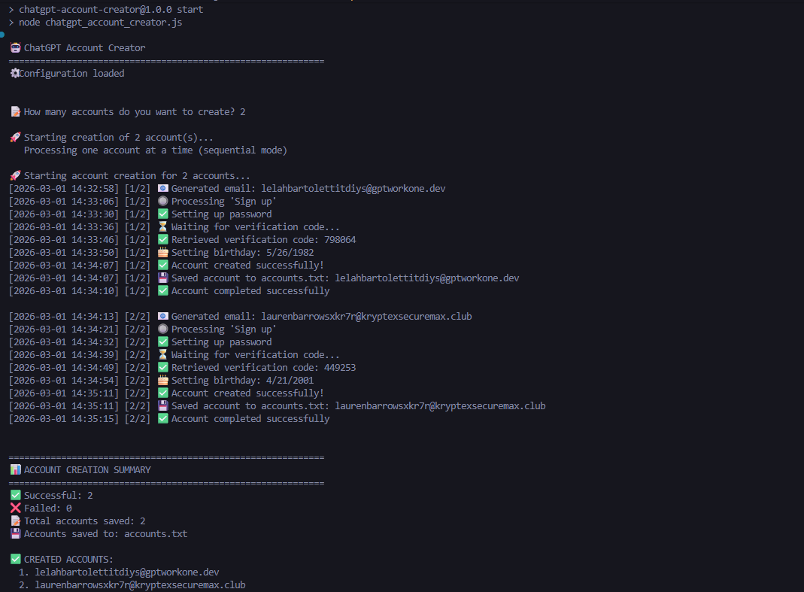

# ChatGPT Account Creator

Sebuah skrip otomatisasi berbasis Node.js yang menggunakan Playwright untuk membuat akun ChatGPT secara otomatis. Skrip ini secara mandiri menghasilkan email sementara, nama acak, tanggal lahir, dan menyelesaikan proses pendaftaran di ChatGPT, termasuk melakukan konfirmasi kode verifikasi otp.



## 🌟 Fitur Utama

- **Otomatisasi Penuh**: Mengisi seluruh form pendaftaran ChatGPT secara otomatis.
- **Email Sementara Acak**: Menggunakan API/scraping khusus dari `generator.email` untuk menghasilkan email dan mengambil kode OTP.
- **Bypass & Stealth**: Dilengkapi skrip *stealth* untuk Firefox guna menghindari deteksi webdriver/bot.
- **Data Acak (Faker)**: Menggunakan `@faker-js/faker` untuk penamaan akun yang realistis berdasarkan letak geografis atau acak.
- **Penyimpanan Praktis**: Semua akun yang sukses register otomatis terdata dengan rapi di dalam file `accounts.txt`.
- **Custom Config**: Mendukung pengaturan yang dapat disesuaikan `config.json` untuk *password* default, mode eksekusi (headless), dll.

## 📋 Persyaratan Sistem

Pastikan Anda sudah menginstal:
- **Node.js**: Versi 18.0.0 atau yang lebih baru.
- **NPM**: Biasanya sudah termasuk bersama instalasi Node.js.

## 🚀 Instalasi

1. Pastikan Anda berada di direktori proyek ini.
2. Buka terminal atau Command Prompt.
3. Instal semua paket/library NPM yang dibutuhkan dengan perintah:
   ```bash
   npm install
   ```
4. Instal *binary browser* Firefox untuk Playwright:
   ```bash
   npm run install-browsers
   ```
   *(Catatan: Anda juga bisa menjalankan secara manual `npx playwright install firefox`)*

## ⚙️ Konfigurasi (`config.json`)

Agar skrip dapat berjalan dengan baik, Anda wajib mengatur kata sandi (password). 
Jika `config.json` belum ada, jalankan skrip sekali agar file terbuat secara otomatis. Buka file tersebut dan atur konfigurasinya:

```json
{
  "max_workers": 3,
  "headless": false,
  "slow_mo": 1000,
  "timeout": 30000,
  "password": "GantiPasswordAnda123!"
}
```

* **`password`** (Wajib): Ganti dengan kata sandi yang ingin Anda tetapkan (OpenAI mewajibkan **minimal 12 karakter**).
* **`headless`**: Ubah ke `true` jika Anda tidak ingin memunculkan jendela browser saat proses instalasi berjalan (jalan di latar belakang).

## 💻 Cara Penggunaan

1. Buka terminal dan pastikan ada di dalam direktori proyek.
2. Jalankan skrip dengan mengetik:
   ```bash
   npm start
   ```
   *(Atau secara langsung: `node chatgpt_account_creator.js`)*
3. Anda akan ditanya perihal jumlah akun:
   ```text
   📝 How many accounts do you want to create?
   ```
4. Masukkan angka (misal: `5`) dan tekan `Enter`.
5. Skrip akan membuka Firefox (jika mode headless `false`) dan memulai pembuatan akun satu per satu secara berurutan.
6. Pantau prosesnya! Akun yang berhasil dibuat akan disimpan di `accounts.txt` dalam format `email|password`.

---

## ⚠️ Disclaimer (Perhatian)

1. **Penggunaan Bebersama** Skrip ini ditujukan murni untuk sekadar alat bantu pembelajaran (*automations web testing*). 
2. Membuat akun dalam jumlah besar secara terus-menerus bisa menyebabkan pemblokiran akses koneksi IP oleh provider situs (Cloudflare / OpenAI). 
3. Gunakan dengan tanggung jawab sendiri. Risiko pemblokiran akun berada di tangan pengguna.
